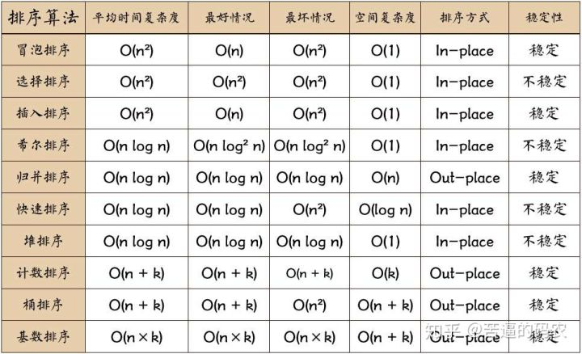
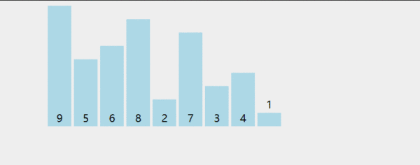
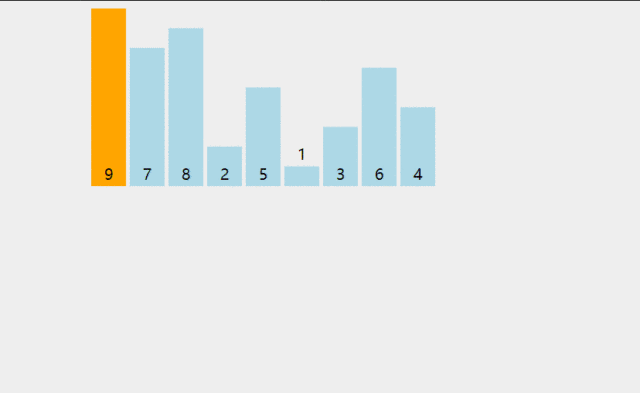
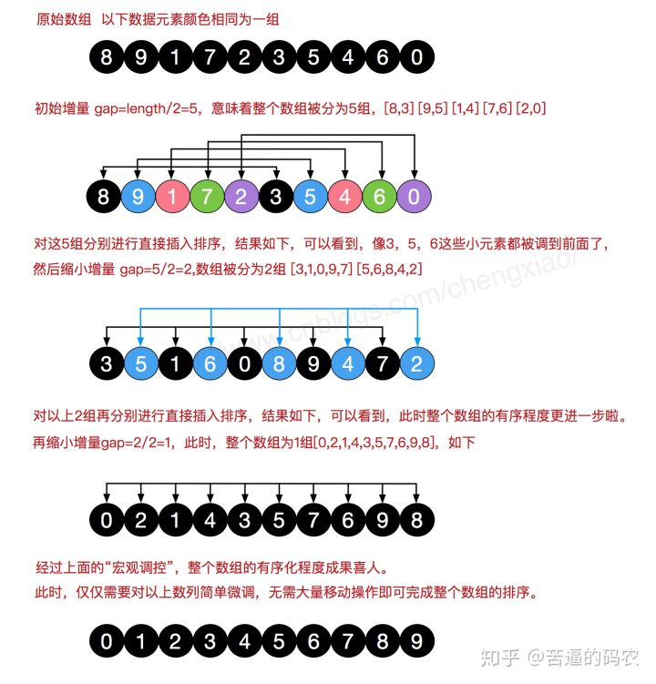
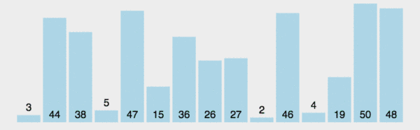
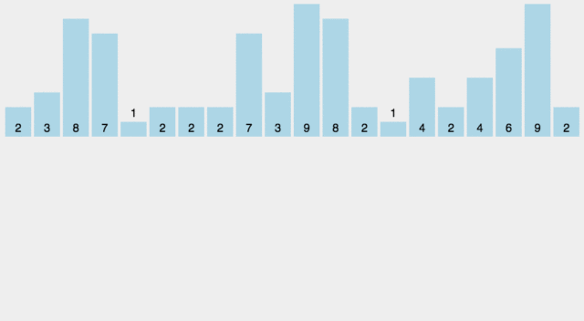
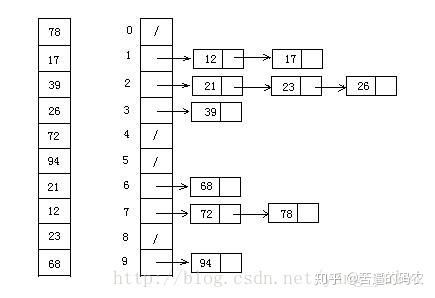
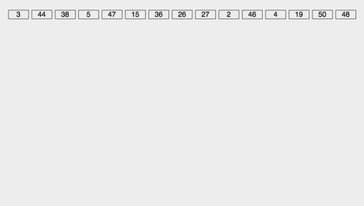

# 1.冒泡排序 
[冒泡排序](https://mp.weixin.qq.com/s/6mzB4X5D8AY9F20c_mlQFQ) 
 
 
# 2.选择排序 
[选择排序](https://mp.weixin.qq.com/s/KaPFukstz-0B89KLv49dUw) 
 
 
# 3.插入排序 
[插入排序](https://mp.weixin.qq.com/s/VNvGXsTpGgzUhQlRJ1GsTA) 
 
 
# 4.希尔排序 
[希尔排序](https://mp.weixin.qq.com/s/4kJdzLB7qO1sES2FEW0Low) 
 
 
# 5.归并排序 
[归并排序](https://mp.weixin.qq.com/s/YNF-6vY5m2Q_kEXJbep5NQ) 
 
 
# 6.快速排序 
[不要再问我快速排序](https://mp.weixin.qq.com/s?__biz=Mzg2NzA4MTkxNQ==&mid=2247485191&idx=1&sn=45a43bd77495566db53b419ae82136f5) 
 
 
# 7.堆排序 
[堆排序是什么鬼？](https://mp.weixin.qq.com/s?__biz=Mzg2NzA4MTkxNQ==&mid=2247485230&idx=1&sn=d45e16847df951512b3eb97f313a8086&source=41) 
 
 
# 8.计数排序 
[什么是计数排序？](https://mp.weixin.qq.com/s/bIQnEL2eIehQtpTKrkc7uw) 
 
 
# 9.桶排序 
[什么是桶排序？](https://mp.weixin.qq.com/s/j3ki5PBeQdeABjmEyWvbuA) 
 
 
# 10.基数排序 
[为什么说O(n)复杂度的基数排序没有快速排序快？](https://mp.weixin.qq.com/s?__biz=Mzg2NzA4MTkxNQ==&mid=2247485148&idx=1&sn=79dd7c1a714b25937bf32d693b44a756&source=41) 
 